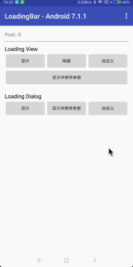

# LoadingBar

[中文文档](README.md)

LoadingBar has been upgraded to `2.0`, [1.x](https://github.com/dengyuhan/LoadingBar/tree/1.x) cannot be migrated 2.0, [1.x](https://github.com/dengyuhan/LoadingBar/tree/1.x) will continue to maintain.

## Download Example


## Gralde Import
```java
implementation 'com.dyhdyh.loadingbar2:loadingbar:2.0.1'
```

## Simple Usage (default style)
#### LoadingView
```
//show loading in the form of View.
//the parent here needs to be an overlayable layout. If the layout is not overwriteable, will look up the hierarchy.
//FrameLayout/RelativeLayout/ConstraintLayout/DrawerLayout/CoordinatorLayout/CardView
LoadingBar.view(parent).show();

//to cancel correctly, have to is the same parent as show().
LoadingBar.view(parent).cancel();
```

#### LoadingDialog
```
//show loading in the form of Dialog.
//note that context cannot be used ApplicationContext here.
LoadingBar.dialog(context).show();

//cancel dialog
//to cancel correctly, have to is the same context as show().
LoadingBar.dialog(context).cancel();
```

## Advanced Usage
#### LoadingView

```
LoadingBar.view(parent)
        //create a factory to change the style.
        //.setFactory(new CustomViewFactory())
        //create a view to change the style.
        //.setFactoryFromView(view)
        //set the style using the layout ID.
        .setFactoryFromResource(R.layout.layout_custom)
        //carrying extra info.
        .extras(new Object[]{})
        .show();

//create a factory to change the style.
public class CustomViewFactory implements LoadingFactory<ViewGroup, View> {

    /**
     * Factory class identifier
     * If when calling show() multiple times before cancel(), will not call again onCreate() when key is the same.
     * @return
     */
    @Override
    public String getKey() {
        return getClass().getName();
    }

    @Override
    public View onCreate(ViewGroup parent) {
        //Here the view of return is the style of Loading
        return LayoutInflater.from(parent.getContext()).inflate(R.layout.layout_custom, parent, false);;
    }

    @Override
    public void updateStatus(Object[] extras) {
    	//Each call to show() will call back here, including the extras carried
    }
}
```

#### LoadingDialog

```
LoadingBar.dialog(context)
        //create a factory to change the style.
        //.setFactory(new CustomDialogFactory())
        //create a view to change the style.
        //.setFactoryFromView(view)
        //set the style using the layout ID.
        .setFactoryFromResource(R.layout.layout_custom)
        //carrying extra info.
        .extras(new Object[]{})
        .show();

//create a factory to change the style.
public class CustomDialogFactory implements LoadingFactory<Context, Dialog> {
    /**
     * Factory class identifier
     * If when calling show() multiple times before cancel(), will not call again onCreate() when key is the same.
     * @return
     */
    @Override
    public String getKey() {
        return getClass().getName();
    }

    @Override
    public Dialog onCreate(Context params) {
        //Here the dialog of return is the style of Loading
        return new AlertDialog.Builder(params)
                .setView(R.layout.layout_custom)
                .setCancelable(false)
                .create();
    }

    @Override
    public void updateStatus(Object[] extras) {
    	//Each call to show() will call back here, including the extras carried
    }
}
```

If it is a `Factory` created by anonymous inner class, `getKey()` needs to be customized to ensure that styles can be distinguished, For example, use `layoutId` to distinguish.

```
private LoadingFactory<ViewGroup, View> createViewFactoryFromResource(@LayoutRes int layoutId) {
        return new LoadingFactory<ViewGroup, View>() {

            @Override
            public String getKey() {
                return String.format(Locale.getDefault(), "ViewFactoryFromResource@%d", layoutId);
            }

            @Override
            public View onCreate(ViewGroup parent) {
                return LayoutInflater.from(parent.getContext()).inflate(layoutId, parent, false);
            }

            @Override
            public void updateStatus(Object[] extras) {

            }
        };
    }
```

## Other API
#### ControllerHandler
```
//Use ControllerHandler to further customize
//The following example demonstrates the replacement of the Parent lookup strategy for LoadingView.
LoadingBar.view(loadingContainer)
        .setControllerHandler(new ControllerHandler() {
            @Override
            public void handle(LoadingController controller) {
                //Set the Parent lookup strategy
                if (controller instanceof LoadingViewController) {
                    ((LoadingViewController) controller).setParentStrategy(new SimpleParentStrategy());
                }
            }
        }).show();
```

#### Manual Release
When calling `cancel()`, the LoadingBar will be automatically released. If there is an abnormal cancel, you can call `release` to manually release it.

```
LoadingBar.release();
```

You can check the number of resources that are not currently released by `getPoolCount`.
```
LoadingBar.getPoolCount();
```

## Screenshot

