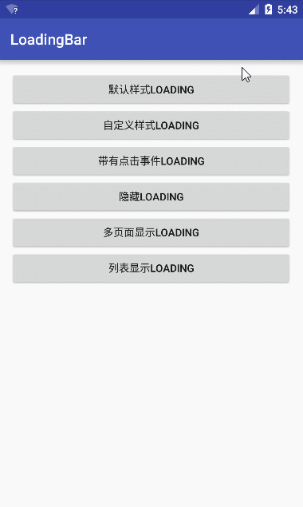

# LoadingBar

###Screenshot


###Android Studio - 在build.gradle中引入
```java
compile 'com.dyhdyh.loadingbar:loadingbar:1.1'
```
<br/>
####Example
```java
//显示loading(父容器)
//如果传入的parent是getWindow().getDecorView()，Loading就会作用于整个屏幕
LoadingBar.show(parent); 

//显示loading(父容器,自定义样式View,自定义样式View的点击事件)
LoadingBar.show(parent,customView,customViewClickListener); 

//隐藏loading
LoadingBar.hide();
```

####Warning
show方法中传的parent，目前仅支持FrameLayout|RelativeLayout|DrawerLayout|CoordinatorLayout，这样才能覆盖在内容上面。


######对这个组件有不懂的地方可以进QQ群问我:146262062
