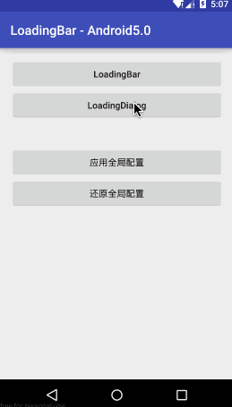
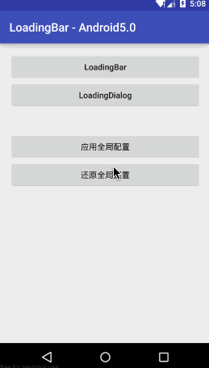

# LoadingBar

## 快速开始
### Android Studio - 在build.gradle中引入
```java
compile 'com.dyhdyh.loadingbar:loadingbar:1.4.0'
```
#### LoadingBar
```java
//默认样式 loading将会覆盖在parent的内容上面
LoadingBar.make(parent).show();

//自定义样式
LoadingBar.make(parent,loadingFactory).show();

//完全自定义
LoadingBar.make(parent,loadingFactory)
        .setOnClickListener(clickListener)//点击事件
        .setOnLoadingBarListener(loadingBarListener)//当loadingbar取消的时候回调
        .show();
        
//取消Loading
LoadingBar.cancel(parent);
```

#### LoadingDialog
```java
//默认样式
LoadingDialog.make(context).show();

//自定义样式
LoadingDialog.make(context, dialogFactory).show();

//完全自定义
LoadingDialog.make(context, dialogFactory)
           .setMessage(message)//提示消息
           .setCancelable(cancelable)
           .show();

//设置更多属性
Dialog dialog = LoadingDialog.make(context, dialogFactory)
           .setMessage(message)//提示消息
           .setCancelable(cancelable)
           .create();
dialog.setOnCancelListener(cancelListener);
dialog.set...
dialog.show();
           
//取消Loading
LoadingDialog.cancel();
```


#### 全局配置
```java
//自定义样式并应用于全局
LoadingConfig.setFactory(loadingFactory,dialogFactory);

```


</br>
更多玩法等你发掘，有问题或者建议请在issues提出
######Android交流QQ群:146262062
